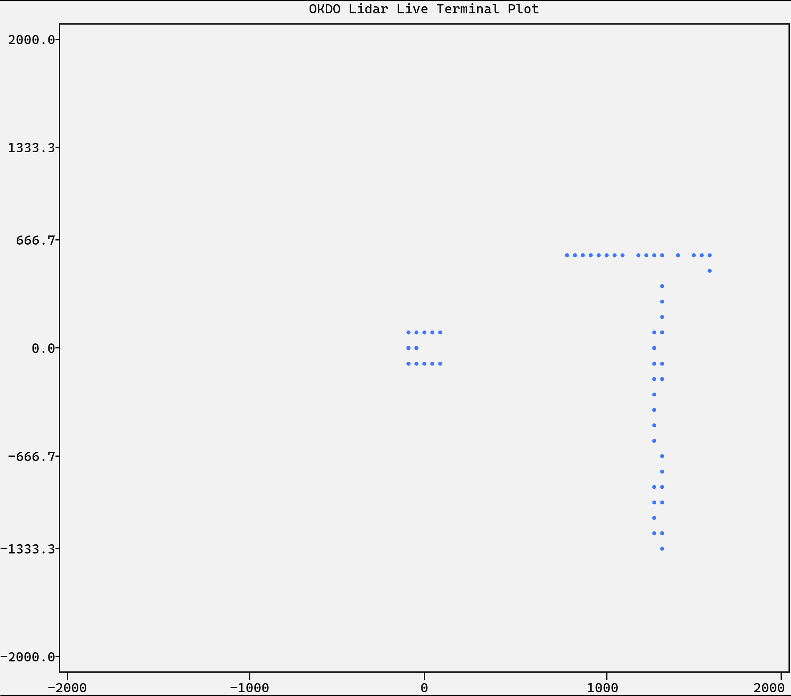
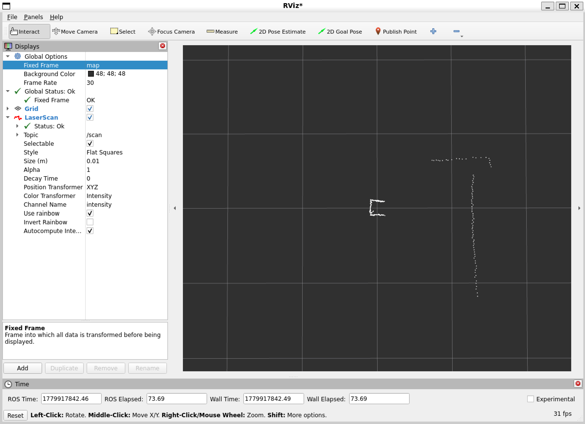
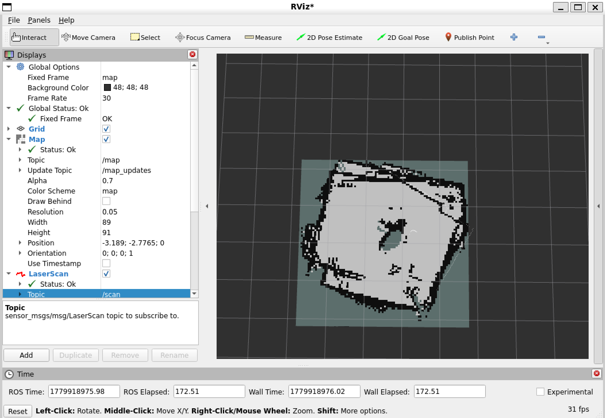

# EE2-Balance-Robot-LiDAR
Raspberry Pi OS: Raspberry Pi 64 bit Lite OS

WSL distribution: Ubuntu 22.04

LiDAR datasheet: [LD19 datasheet](./LDROBOT_LD19_Development_Manual_EN_v2.5.pdf)
(LD06: https://www.yahboom.net/xiazai/LiDar-LD06/LDROBOT_LD06_Development_manual.pdf)

## Terminal visualiser - `lidar.py`
Parsed raw data from the lidar can be visualised in the terminal. The graph plot in the terminal will have 360 points of what can be seen by the LiDAR. The code currently is set show detections within a 2m radius with intensity of 30 or greater.

### Dependencies
``` bash
# setup python local environment
sudo apt update
sudo install python3-venv
python3 -m venv .venv

# enter local environment
source .venv/bin/activate

# download dependencies
pip install pyserial
pip install plotext
```

### Running the program
``` bash
python lidar.py
```

### Expected output


## ROS2
`lidar_udp_sender.py`: Run on Raspberry Pi

Data is parsed using the same logic as `lidar.py`, it is packaged into JSON and sent over UDP to your laptop's IP address

`lidar_udp_receiver.py`: Run on laptop (WSL)

Laptop receives UDP packets and translates the data packets from LiDAR into data appropriate for visualisation in ROS2 using Rviz2.

### Dependencies
```bash
# Raspberry Pi in python local environment
pip install pyserial
pip install socket
pip install json

# Laptop WSL in python local environment
pip install socket
pip install json
```

Install ROS2 Humble Hawksbill - Follow documentation for installation process: https://docs.ros.org/en/humble/Installation/Alternatives/Ubuntu-Development-Setup.html

### Running the program
```bash
# On Raspberry Pi and in python local environment
python lidar_udp_sender.py

#WSL terminal and in python local environment
export ROS_LOCALHOST_ONLY=0
source ~/ros2_ws/install/setup.bash
python lidar_udp_receiver.py

# in another separate WSL terminal
export ROS_LOCALHOST_ONLY=0
source /opt/ros/humble/setup.bash
export LIBGL_ALWAYS_SOFTWARE=1
rviz2
```

### Expected output
Same real time LiDAR output in ROS2 as the terminal output above

Make sure to select /scan as the topic for LaserScan node


## SLAM on ROS2
`lidar_udp_sender`: Run on Raspberry Pi, same file sending data out via UDP

`launcher.py`: Able to manually map an environment using SLAM with the LiDAR

### Dependencies
```bash
sudo apt update
sudo apt install ros-humble-slam-toolbox
sudo apt install python3-colcon-common-extensions

mkdir -p ~/ros2_ws/src
cd ~/ros2_ws/src
git clone -b ros2 https://github.com/MAPIRlab/rf2o_laser_odometry.git
cd ~/ros2_ws
colcon build --symlink-install
```

### Running the program
```bash
# Raspberry Pi in python local environment
python lidar_udp_sender.py

# WSL in python local environment
ros2 launch launcher.pys
```

### Expected output
Current setup is reliant on the LiDAR itself for odometry, which is not ideal as flat walls look the same at different distances. To have good results, map a room with some interesting features (e.g. corners) which SLAM can lock onto. When mapping, avoid rotating the LiDAR to have a cleaner map of the environment.



## Further development
* Integrate with robot IMU for odometry (forward and backward)
* Integrate with robot motor data for odometry (turning)
* Integrate with robot camera for obstacle detection (outside of planar FOV of LiDAR)

## Sensor Fusion with IMU

```bash
# to run launcher on WSL terminal
cd ~/Documents/EE2-Balance-Robot-LiDAR-ROS2
source /opt/ros/humble/setup.bash
source ~/ros2_ws/install/setup.bash
ros2 launch ./launcher.py

```

## Wheel-Odometry + IMU Fusion (drift-free mapping)

Earlier maps showed **duplicated walls**: the same wall drawn twice with a slight
offset. The cause was **heading drift** — the EKF relied on scan-matching odometry
(rf2o) plus the MPU's *absolute* (integrated, drifting) yaw, so on revisiting a spot
the heading was wrong and loop closure failed. The fix feeds slam_toolbox a clean
`odom -> base_link` transform built from **wheel odometry for translation** and the
**bias-calibrated gyro yaw-rate for rotation**, fused by `robot_localization`.

### Data flow

```
ESP32 (50 Hz, one ASCII line)        ODOM:<t_ms>,<left_steps>,<right_steps>,<yaw_rate>
  -> USB serial -> client.py (Pi) -> UDP/JSON {"odom":{t_ms,left_steps,right_steps,yaw_rate}}
  -> sensors_udp_receiver.py:
        /scan                (LaserScan, frame laser_frame)
        /imu/data            (Imu, frame imu_link)        -- yaw RATE only, no absolute yaw
        /wheel/joint_states  (JointState)                  -- raw signed microstep counts,
                                                              stamped with the ESP32 clock
  -> wheel_odometry_node.py:
        /wheel/odom          (Odometry, odom->base_link)   -- vx trusted, yaw NOT
  -> robot_localization ekf_node:  fuses wheel vx + gyro vyaw
        TF odom -> base_link, /odometry/filtered
  -> slam_toolbox:  TF map -> odom, /map
```

TF tree (body-tilt handling deferred): `map -> odom -> base_link -> {laser_frame, imu_link}`.

### Why these choices

* **Wheel vx, not rf2o**, for translation: steppers don't slip much longitudinally
  and wheel odometry is immune to the scan-symmetry that makes rf2o double walls.
* **Gyro yaw-*rate*, not absolute yaw**: a rate fused by the EKF cannot inherit the
  MPU's integration drift; global heading is corrected by slam_toolbox loop closure.
* **Gyro bias** is removed on the ESP32 at boot by `calibrateIMU()` — hold the robot
  still and upright for ~1 s at power-on.
* Wheel **heading** is distrusted (huge covariance) because open-loop steppers can
  drop steps under the dynamic load of balancing, with no encoder to confirm.

### Key parameters (`wheel_odometry_node.py`, override in `launcher.py`)

| Param | Default | Notes |
|---|---|---|
| `steps_per_rev` | 200 | full steps/rev (from `step.h`) |
| `microstepping` | 16 | microsteps/full-step (from `step.h`) |
| `wheel_diameter` | 0.065 | measured: 6.5 cm |
| `wheel_base` | 0.12 | measured: 12 cm track width |
| `left_sign` / `right_sign` | +1 / -1 | flip so a forward push gives positive deltas |
| `vx_variance` | 0.002 | small — vx is trusted |
| `wz_variance` | 1e6 | huge — wheel heading is not trusted |

`GYRO_SIGN` and `REVERSE_SCAN_DIRECTION` (top of `sensors_udp_receiver.py`) set the
gyro-rate and scan-sweep signs; verify them with the bring-up checks below.

### Bring-up / validation

```bash
# 1. Sign checks
#    - push the robot forward by hand: ros2 topic echo /wheel/joint_states deltas > 0
#    - rotate the robot CCW: ros2 topic echo /imu/data -> angular_velocity.z > 0
#    Flip left_sign/right_sign or GYRO_SIGN if not.
# 2. Straight ~2 m:  ros2 topic echo /odometry/filtered -> x advances ~2 m, yaw ~unchanged
# 3. In-place 360 deg: yaw integrates ~360 deg and returns near start
# 4. Closed loop around a room: single walls in RViz, loop closure fires
ros2 run tf2_tools view_frames        # expect map->odom->base_link->{laser_frame,imu_link}
ros2 bag record -a                    # capture a run for before/after comparison
```